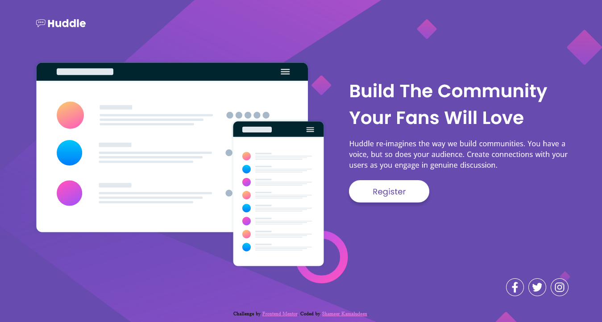

# Frontend Mentor - Huddle landing page with single introductory section solution

This is a solution to the [Huddle landing page with single introductory section challenge on Frontend Mentor](https://www.frontendmentor.io/challenges/huddle-landing-page-with-a-single-introductory-section-B_2Wvxgi0). Frontend Mentor challenges help you improve your coding skills by building realistic projects. 

## Table of contents

- [Overview](#overview)
  - [The challenge](#the-challenge)
  - [Screenshot](#screenshot)
  - [Links](#links)
- [My process](#my-process)
  - [Built with](#built-with)
  - [What I learned](#what-i-learned)
  - [Continued development](#continued-development)
  - [Useful resources](#useful-resources)
- [Author](#author)
- [Acknowledgments](#acknowledgments)

## Overview

I have been following only the Frontend Mentor challenges so far after some point of learning frontend, as each challenge completed from the Frontend Mentor started viewing the development in different aspects as the struggle to align basic components started getting familiarized enough.

The challenge helps to learn the responsiveness in different breakpoints if we utilize it in that line. The background, button, flexibility of the layout of the section, font size, alignment of different elements and sizes of other small components are the areas we can concentrate on responsive factor on different breakpoints.

### The challenge

Users should be able to:

- View the optimal layout for the page depending on their device's screen size
- See hover states for all interactive elements on the page

### Screenshot

### Links

- Solution URL: [Click here](https://github.com/shameerkamaludeen/huddle-landing-page-with-single-introductory-section)
- Live Site URL: [Click here](https://shameerkamaludeen.github.io/huddle-landing-page-with-single-introductory-section/)

## My process

The main point would like to mention here is the responsiveness considered on the basis of where the elements started breaking in the layout while the display size changes. The idea chosen from the [MDN media queries](https://developer.mozilla.org/en-US/docs/Learn/CSS/CSS_layout/Media_queries) learning section seemed a better approach rather than relying on the particular breakpoint for the different device in other words used media queries on where the element starts breaking regardless of considering different breakpoints.

### Built with

- Semantic HTML5 markup
- Flexbox
- Mobile-first workflow

### What I learned

Started seeing the development on different aspects compared to the previous challenges. Started focusing on the entire design on different display widths and how the elements were laid out.

### Continued development

The following part of the learnings needs to improve as I spend on these very little or may require enough time to master it:
- Transition
- Transform
- animation
- Layout and element or components size on different display widths
- Typography
- Professionally accurate designs

### Useful resources

- [Beginner's guide to media queries](https://developer.mozilla.org/en-US/docs/Learn/CSS/CSS_layout/Media_queries) - This helped me to choose the best practices for responsive design.

## Author

- Github - [Shameer Kamaludeen](https://github.com/shameerkamaludeen)
- Frontend Mentor - [@shameerkamaludeen](https://www.frontendmentor.io/profile/shameerkamaludeen)
- Twitter - [@ShameerKamalud1](https://twitter.com/ShameerKamalud1)

## Acknowledgments

Thanks to Frontend Mentor for providing this opportunity to improve the front end skill.
